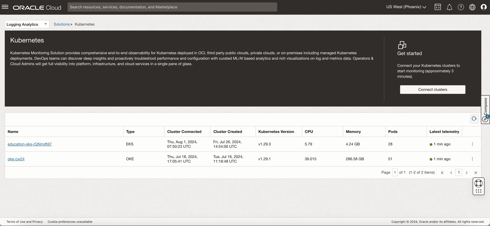
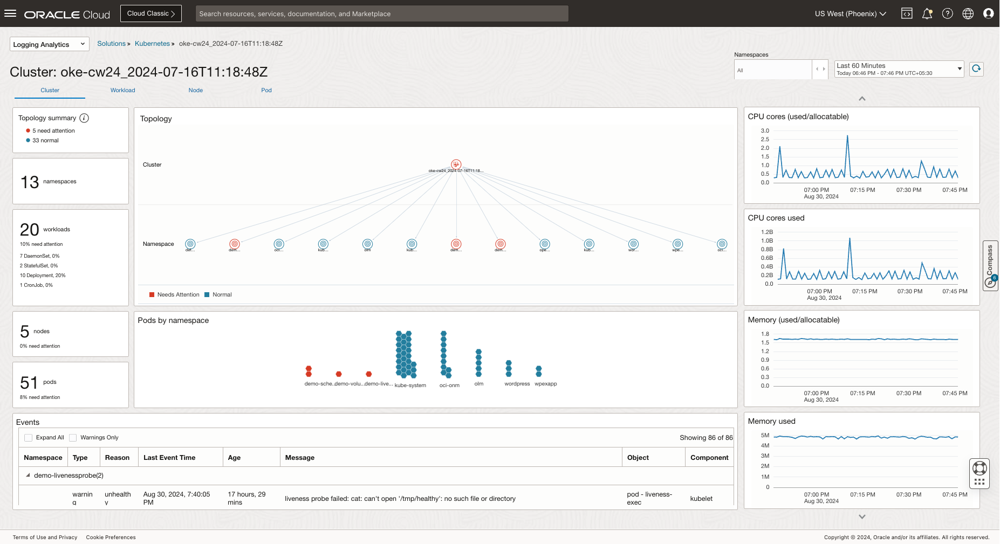
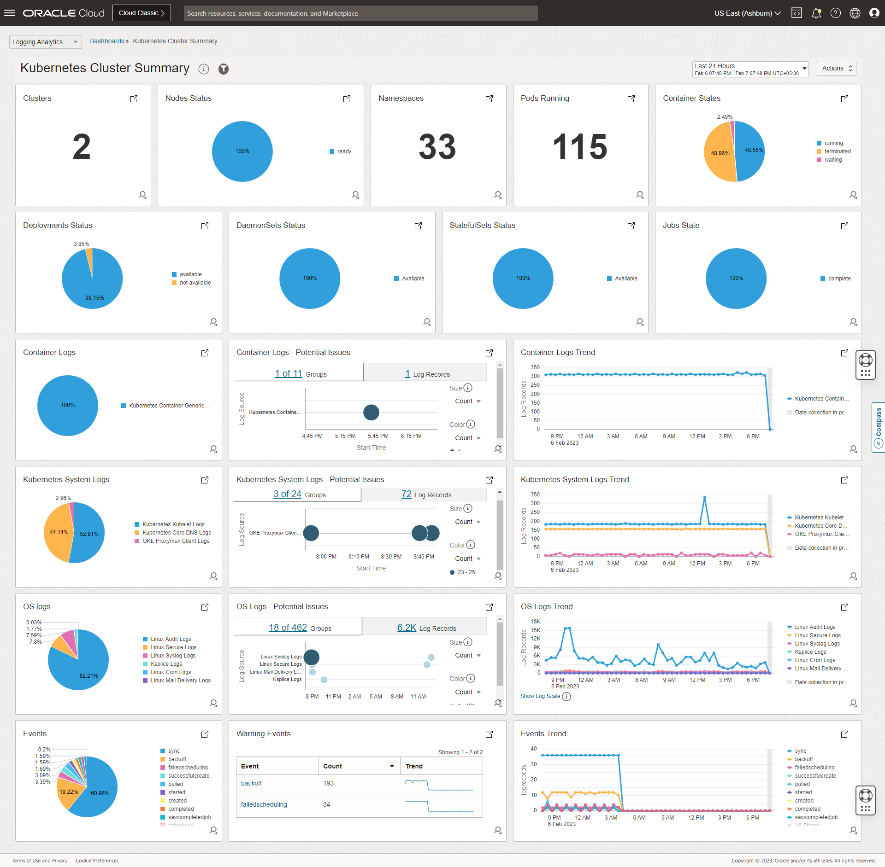
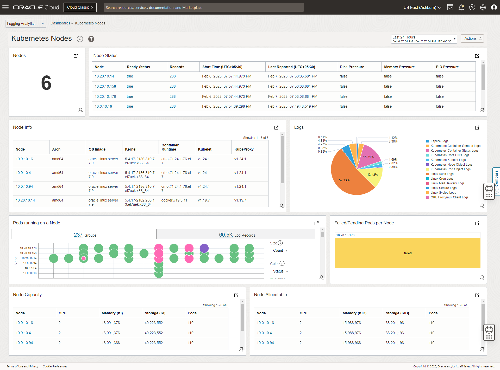
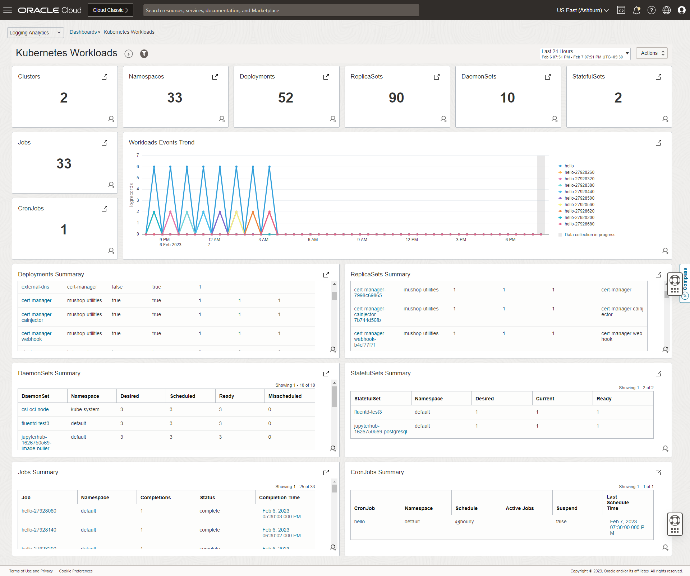
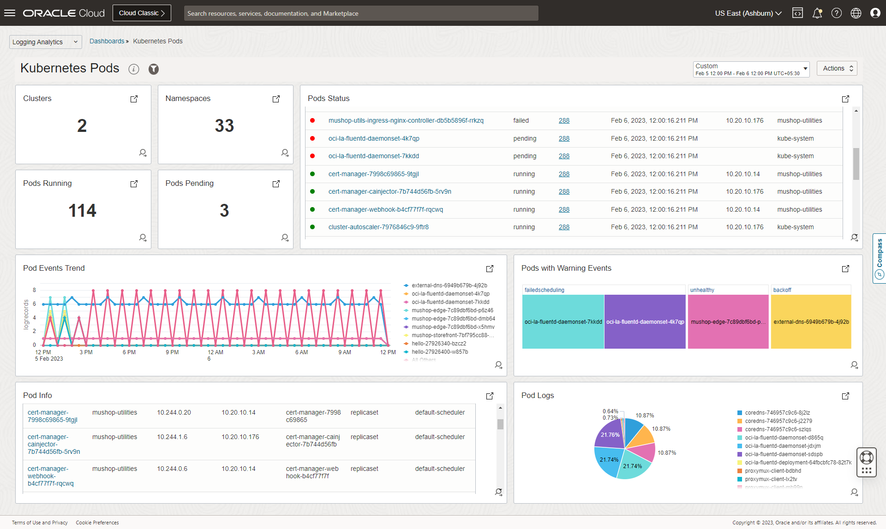

# OCI Kubernetes Monitoring Solution

OCI Kubernetes Monitoring Solution is a turn-key Kubernetes monitoring and management package based on OCI Logging Analytics cloud service, OCI Monitoring, OCI Management Agent and Fluentd.

It enables DevOps, Cloud Admins, Developers, and Sysadmins to

* Continuously monitor health and performance
* Troubleshoot issues and identify their root causes
* Optimize IT environment based on long term data
* Identify configuration, and security issues

across their entire environment - using Logs, Metrics, and Object metadata.

It does extensive enrichment of logs, metrics and object information to enable cross correlation across entities from different tiers in OCI Logging Analytics. A collection of dashboards is provided to get users started quickly.

## Solution UI




## Dashboards



<details>
  <summary>Expand for more dashboard screenshots</summary>







</details>


## Get Started :rocket:

:stop_sign: Upgrading to a major version (like 2.x to 3.x)? See [upgrade](#upgrading-to-a-major-version) section below for details. :warning:

### Pre-requisites

* OCI Logging Analytics service must be onboarded with the minimum required policies, in the OCI region where you want to monitor. Refer [Logging Analytics Quick Start](https://docs.oracle.com/en-us/iaas/logging-analytics/doc/quick-start.html) for details.
* Create OCI Logging Analytics LogGroup(s) if not done already. Refer [Create Log Group](https://docs.oracle.com/en-us/iaas/logging-analytics/doc/create-logging-analytics-resources.html#GUID-D1758CFB-861F-420D-B12F-34D1CC5E3E0E) for details.
* OCI Dynamic Groups, User Group and Policies.
  <details>
    <summary>Details</summary>
  
  * Create a dynamic group with the following sample rule for OCI Management Agent. Refer [Managing Dynamic Groups](https://docs.oracle.com/en-us/iaas/Content/Identity/Tasks/managingdynamicgroups.htm) for details.
    ```
    ALL {resource.type='managementagent', resource.compartment.id='OCI Management Agent Compartment OCID'}
    ```
  * Create a dynamic group with following sample rule for OKE Instances. 
    ```
    ALL {instance.compartment.id='OKE Cluster Compartment OCID'}
    ```
    - **Note**: _This dynamic group is not required for non OKE or when you choose to use Config file based AuthZ for monitoring the logs._
  * Create a user and user group using which the logs to be published to OCI Logging Analytics. Refer [Managing Users](https://docs.oracle.com/en-us/iaas/Content/Identity/Tasks/managingusers.htm) and [Managing User Groups](https://docs.oracle.com/en-us/iaas/Content/Identity/Tasks/managinggroups.htm) for details.
    - **Note**: _This is not required for OKE when you choose to use the default (Instance principal) AuthZ mechanism._
  * Create a policy with following statements.
    * Policy Statement for providing necessary access to upload the metrics.
      ```
      Allow dynamic-group <OCI Management Agent Dynamic Group> to use metrics in compartment <Compartment Name> WHERE target.metrics.namespace = 'mgmtagent_kubernetes_metrics'
      ```
    * Policy Statement for providing necessary access to upload the logs and objects data.
      ```
      Allow dynamic-group <OKE Instances Dynamic Group> to {LOG_ANALYTICS_LOG_GROUP_UPLOAD_LOGS} in compartment <Compartment Name>
      Allow dynamic-group <OKE Instances Dynamic Group> to {LOG_ANALYTICS_DISCOVERY_UPLOAD} in tenancy
      ```
      OR
      ```
      Allow group <User Group> to {LOG_ANALYTICS_LOG_GROUP_UPLOAD_LOGS} in compartment <Compartment Name>
      Allow group <User Group> to {LOG_ANALYTICS_DISCOVERY_UPLOAD} in tenancy
      ```
      - **Note**: _The policy definition for LOG_ANALYTICS_DISCOVERY_UPLOAD permission only works at tenancy level and thereby it must be created at tenancy level._
  </details>

### Installation instructions 

#### Multiple methods of installation are available, with following differences:

| Deployment Method | Supported Environments | Solution UI | Dashboards | Customisations | Comments |
| :----: | :----: | :----: | :----: | :----: | :----: |
| OCI Logging Analytics Connect Cluster | OKE*** | :heavy_check_mark: | Manual | Partial Control (Recommended) | Customisations are possible through `Helm` once deployed using `Logging Analytics Connect Cluster` flow from Console, which is applicable for both Automatic and Manual Deployment modes. We recommend choosing Manual Deployment mode for OKE clusters with Private API Server endpoint, as support for the automatic deployment for the same would be available soon. |
| Helm | All* | :heavy_check_mark:**  | Manual| Full Control (Recommended) | |
| OCI Resource Manager | OKE | :heavy_check_mark:** | :heavy_check_mark: | Partial Control | Customisations are possible through `Helm` once deployed using `OCI Resource Manager`. | 
| Terraform | OKE | :heavy_check_mark:** | :heavy_check_mark: | Partial Control | Customisations are possible through `Helm` once deployed using `Terraform`. | 
| kubectl | All* | :heavy_check_mark:** | Manual | Full Control (Not recommended) | |

\* For some environments, modification of the configuration may be required.

\** Solution UI experience including Topology and other visualisations are available for customers deploying the solution using methods other than `OCI Logging Analytics Connect Cluster`, only if some additional steps are followed as mentioned in their individual sections.

\*** Connect cluster support for EKS and clusters other than OKE (partially automated flow) would be available soon. Meanwhile, if you would like to experience the Solution for EKS, use [helm](#helm) or other deployment methods.

#### OCI Logging Analytics Connect Cluster

This newly launched UI based workflow from Logging Analytics Console is the recommended approach to start enabling Kubernetes Monitoring Solution for your OKE clusters. In this approach, you would go through a guided flow to enable the monitoring. It has support for both Automatic and Manual deployment modes to install helm charts onto your OKE clusters. The creation of various OCI resources like Logging Analytics LogGroup, Entity, Management Agent Install Key is automatically taken care in this approach irrespective of the deployment method that you choose. The required IAM Dynamic Group and Policies for the collection of logs, metrics, objects discovery data into OCI, can be optionally enabled when using this flow. 

Customisations are possible through helm once deployed using `Logging Analytics Connect Cluster` flow from Console, which is applicable for both Automatic and Manual Deployment modes. We recommend choosing Manual Deployment mode for OKE clusters with Private API Server endpoint, as support for the automatic deployment for the same would be available soon. 

Refer [this doc](https://docs.oracle.com/en-us/iaas/logging-analytics/doc/kubernetes-solution.html) for complete instructions on using this approach. 

:hourglass_flowing_sand: Connect cluster support for EKS and clusters other than OKE (partially automated flow) would be available soon. Meanwhile, if you would like to experience the Solution for EKS, use [helm](#helm) or other deployment methods.

#### Helm

##### 0 Pre-requisites

* Workstation or OCI Cloud Shell with access configured to the target k8s cluster.
* Helm ([Installation instructions](https://helm.sh/docs/intro/install/)).
* [OCI CLI](https://docs.oracle.com/en-us/iaas/Content/API/Concepts/cliconcepts.htm)

##### 1 Create Logging Analytics Entity of type Kubernetes Cluster

* Prepate Entity metadata which represents Kubernetes Cluster's details.
  - Sample entity_metadata.json
    ```
    {"items":[{"name":"cluster","value":"<Cluster_Name>_<Cluster_Creation_Time>","type":"k8s_solution"},{"name":"cluster_date","value":"<Cluster_Creation_Time>","type":"k8s_solution"},{"name":"cluster_name","value":"<Cluster_Name>","type":"k8s_solution"},{"name":"cluster_ocid","value":"<Unique_Identifier_of_Cluster>","type":"k8s_solution"},{"name":"deployment_stack_ocid","value":"NA","type":"k8s_solution"},{"name":"deployment_status","value":"NA","type":"k8s_solution"},{"name":"k8s_version","value":"<Kubernetes_Version>","type":"k8s_solution"},{"name":"metrics_namespace","value":"mgmtagent_kubernetes_metrics","type":"k8s_solution"},{"name":"name","value":"<Cluster_Name>_<Cluster_Creation_Time>","type":"k8s_solution"},{"name":"onm_compartment","value":"<O&M_Compartment_OCID>","type":"k8s_solution"},{"name":"solution_type","value":"<Cluster_Type>","type":"k8s_solution"}]}
    ```
    - <Cluster_Name> => Replace with Name of the Cluster.
    - <Cluster_Creation_Time> => Replace with Cluster's creation time in the format, YYYY-MM-DDTHH:MM:SSZ. It is used to distinguish 2 clusters with same name if exists.
    - <Unique_Identifier_of_Cluster> => Replace with OCID of OKE cluster OR ARN of EKS cluster, etc.
    - <Kubernetes_Version> => Replace with version of Kubernetes running on the cluster.
    - <O&M_Compartment_OCID> => Replace with OCID of the compartment in which the `Logging Analytics LogGroup` exists. Note that for the Logging Analytics Solution UI to work properly, you must keep all your OCI resources like  `Logging Analytics LogGroup`, `Logging Analytics Entity`, `Management Agent Install Key` under the same compartment.
    - <Cluster_Type> => Replace with `OKE` for OKE cluster, `EKS` for Amazon EKS Cluster, etc.

* Create Logging Analytics Entity of type Kubernetes Cluster using above created metadata.
  - Sample command to create entity using OCI CLI
    ```
    oci log-analytics entity create --name <Cluster_Name>_<Cluster_Creation_Time>  --namespace-name <Tenancy_Namespace> --compartment-id <O&M_Compartment_OCID> --entity-type-name omc_kubernetes_cluster --metadata file://entity_metadata.json
    ```
    - <Tenancy_Namespace> => Namespace of the tenancy in which the Logging Analytics is subscribed. You find it by `Go to OCI Logging Analytics Administration, click Service Details, and note the namespace value.`

##### 2 Create Logging Analytics LogGroup

Create OCI Logging Analytics LogGroup(s) if not done already. Refer [Create Log Group](https://docs.oracle.com/en-us/iaas/logging-analytics/doc/create-logging-analytics-resources.html#GUID-D1758CFB-861F-420D-B12F-34D1CC5E3E0E) for details.

##### 3 Download helm chart

* [latest](https://github.com/oracle-quickstart/oci-kubernetes-monitoring/releases/latest/download/helm-chart.tgz)
* Go to [releases](https://github.com/oracle-quickstart/oci-kubernetes-monitoring/releases) for a specific version.

##### 4 Update values.yaml

**Note** that for the Logging Analytics Solution UI to work properly, you must keep all your OCI resources like  `Logging Analytics LogGroup`, `Logging Analytics Entity`, `Management Agent Install Key` under the same compartment.

* Create override_values.yaml, to override the minimum required variables in values.yaml.
  - override_values.yaml
    ```
    global:
      # -- OCID for OKE cluster or a unique ID for other Kubernetes clusters.
      kubernetesClusterID:
      # -- Provide a unique name for the cluster. This would help in uniquely identifying the logs and metrics data at OCI Logging Analytics and OCI Monitoring respectively.
      kubernetesClusterName:

    oci-onm-logan:
      # Go to OCI Logging Analytics Administration, click Service Details, and note the namespace value.
      ociLANamespace:
      # OCI Logging Analytics Log Group OCID
      ociLALogGroupID:
      # OCI Logging Analytics Entity (of Kubernetes Cluster Type) OCID.
      ociLAClusterEntityID:
     
    oci-onm-mgmt-agent:
      mgmtagent:
        # Provide the base64 encoded content of the Management Agent Install Key file
        installKeyFileContent: 
    ```
* **Refer to the oci-onm chart and sub-charts values.yaml for customising or modifying any other configuration.** It is recommended to not modify the values.yaml provided with the charts, instead use override_values.yaml to achieve the same.    
  
##### 5.a Install helm release

Use the following `helm install` command to the install the chart. Provide a desired release name, path to override_values.yaml and path to helm chart (oci-onm chart).
```
helm install <release-name> --values <path-to-override-values.yaml> <path-to-helm-chart>
```
Refer [this](https://helm.sh/docs/helm/helm_install/) for further details on `helm install`.

##### 5.b Upgrade helm release

Use the following `helm upgrade` command if any further changes to override_values.yaml needs to be applied or a new chart version needs to be deployed. 
```
helm upgrade <release-name> --values <path-to-override-values.yaml> <path-to-helm-chart>
```
Refer [this](https://helm.sh/docs/helm/helm_upgrade/) for further details on `helm upgrade`.

**Note** : If you have lost the override_values.yaml that was used while installing the helm (OR) you need to get the default one that was used while installing using other approaches like `OCI Logging Analytics Connect Cluster`, `OCI Resource Manager` etc., then run the following command to generate the same. 

```
helm get values <release-name> > override_values.yaml
```
\<release-name> => Replace with release name. The default release name used while installing through `OCI Logging Analytics Connect Cluster` is `oci-kubernetes-monitoring`.

##### 5.c (Optional) Import Dashboards

Dashboards needs to be imported manually. Below is an example for importing Dashboards using OCI CLI.

1. Download and configure [OCI CLI](https://docs.oracle.com/en-us/iaas/Content/API/SDKDocs/cliinstall.htm) or open cloud-shell where OCI CLI is pre-installed. Alternative methods like REST API, SDK, Terraform etc can also be used.
2. Find the **OCID** of the compartment, where the dashboards need to be imported.
3. Download the dashboard JSONs from [here](terraform/modules/dashboards/dashboards_json/).
4. **Replace** all the instances of the keyword - "`${compartment_ocid}`" in the JSONs with the **Compartment OCID** identified in previous step.
    * Following command is for quick reference that can be used in a linux/cloud-shell environment :
        ```
        sed -i "s/\${compartment_ocid}/<Replace-with-Compartment-OCID>/g" *.json
        ```
    * **Note:** Do not replace the keyword {compartment_ocid}. Replace only `<Replace-with-Compartment-OCID>` with your actual target compartment OCID.

5.  **Replace** all the instances of the keywords - "`${freeform_tags}`" and "`${freeform_tags}`" with `{}`
    * Following command is for quick reference that can be used in a linux/cloud-shell environment :

        ```
        sed -i "s/\${freeform_tags}/{}/g" *.json
        sed -i "s/\${defined_tags}/{}/g" *.json
        ```

6. Run the following commands to import the dashboards.

    ```
    oci management-dashboard dashboard import --from-json file://cluster.json
    oci management-dashboard dashboard import --from-json file://node.json
    oci management-dashboard dashboard import --from-json file://workload.json
    oci management-dashboard dashboard import --from-json file://pod.json
    oci management-dashboard dashboard import --from-json file://service-type-lb.json
    ```

##### Uninstall

Use the following `helm uninstall` command to uninstall the chart. Provide the release name used when creating the chart.
```
helm uninstall <release-name>
```
Refer [this](https://helm.sh/docs/helm/helm_uninstall/) for further details on `helm uninstall`.
  
#### OCI Resource Manager

Launch OCI Resource Manager Stack in OCI Tenancy and Region of the OKE Cluster, which you want to monitor.

[![Launch OCI Resource Manager Stack][orm_button]][oci_kubernetes_monitoring_stack]

<details>
  <summary>Instructions</summary>
  
  * Select the region and compartment where you want to deploy the stack.
  * Follow the on-screen prompts and instructions to create the stack.
  * After creating the stack, click Terraform Actions, and select Plan.
  * Wait for the job to be completed, and review the plan.
  * To make any changes, return to the Stack Details page, click Edit Stack, and make the required changes. Then, run the Plan action again.
  * If no further changes are necessary, return to the Stack Details page, click Terraform Actions, and select Apply.
  
</details>    
  
#### Kubectl

<details>
  <summary>While the recommended approach for installation is through helm, if you intend to use `kubectl` based installation, then the resource yaml files can still be generated through `helm` using the instructions provided below.</summary>  

##### 0 Pre-requisites

* Workstation or OCI Cloud Shell with access configured to the target k8s cluster.
* Helm ([Installation instructions](https://helm.sh/docs/intro/install/)).
* Kubectl ([Installation instructions](https://kubernetes.io/docs/tasks/tools/#kubectl)).
* [OCI CLI](https://docs.oracle.com/en-us/iaas/Content/API/Concepts/cliconcepts.htm)

##### 1 Create Logging Analytics Entity of type Kubernetes Cluster

Refer [here](1-create-logging-analytics-entity-of-type-kubernetes-cluster)

##### 2 Create Logging Analytics LogGroup

Refer [here](2-create-logging-analytics-loggroup)

##### 3 Download helm chart

Refer [here](#3-download-helm-chart).

##### 4 Update values.yaml

Refer [here](#4-update-valuesyaml).
  
##### 5.a Generate yamls 

Use the following `helm template` command to generate the resource yaml files. Provide path to override_values.yaml, path to helm chart (oci-onm chart) and path to a dir where the yaml files to be generated.
```
helm template --values <path-to-override-values.yaml> <path-to-helm-chart> --output-dir <path-to-dir-to-store-the-yamls>
```
Refer [this](https://helm.sh/docs/helm/helm_template/) for further details on `helm template`.
  
##### 5.b Install

Use `kubectl` tool to apply the yaml files generated in the previous step in the following order. 

* oci-onm-common
  ```
  kubectl apply -f namespace.yaml
  kubectl apply -f clusterrole.yaml
  kubectl apply -f clusterrolebinding.yaml
  kubectl apply -f serviceAccount.yaml
  ```
* oci-onm-logan
  ```
  kubectl apply -f logs-configmap.yaml
  kubectl apply -f objects-configmap.yaml
  kubectl apply -f fluentd-daemonset.yaml
  kubectl apply -f fluentd-deployment.yaml
  ```
  _For non OKE or when you choose to use Config file based AuthZ for monitoring the logs, you may need to apply oci-config-secret.yaml before applying fluentd-daemonset.yaml & fluentd-deployment.yaml. Refer [here](docs/FAQ.md#how-to-use-configfile-based-authz-user-principal-instead-of-default-authz-instance-principal-) for how to configure Config based AuthZ._ 
* oci-onm-mgmt-agent
  ```
  kubectl apply -f mgmt-agent-secrets.yaml
  kubectl apply -f metrics-configmap.yaml
  kubectl apply -f mgmt-agent-statefulset.yaml
  kubectl apply -f mgmt-agent-headless-service.yaml
  kubectl apply -f metric_server.yaml
  ```

##### 5.c (Optional) Import Dashboards

Refer [here](#3c-import-dashboards).
  
</details>  

### Upgrading to a major version

#### 2.x to 3.x

One of the major changes introduced in 3.0.0 is refactoring of helm chart where major features of the solution got split into separate sub-charts. 2.x has only support for logs and objects collection using Fluentd and OCI Logging Analytics and this is now moved into a separate chart oci-onm-logan and included as a sub-chart to the main chart oci-onm. This is a breaking change w.r.t the values.yaml and any customisations that you might have done on top of it. There is no breaking change w.r.t functionality offered in 2.x. For full list of changes in 3.x, refer to [changelog](CHANGELOG.md). 

You may fall into one of the below categories and may need to take actions accordingly.    
  
##### Have no customisations to the existing chart or values.yaml

We recommend you to uninstall the release created using 2.x chart and follow the installation instructions mentioned [here](#helm) for installing the release using 3.x chart.   

###### Sample 2.x values.yaml (external or override yaml to update the mandatory variables)
  
    image:
       url: <Container Image URL>
       imagePullPolicy: Always
    ociLANamespace: <OCI LA Namespace>
    ociLALogGroupID: ocid1.loganalyticsloggroup.oc1.phx.amaaaaaa......
    kubernetesClusterID: ocid1.cluster.oc1.phx.aaaaaaaaa.......
    kubernetesClusterName: <Cluster Name>

###### Sample 3.x values.yaml
    
    global:
      # -- OCID for OKE cluster or a unique ID for other Kubernetes clusters.
      kubernetesClusterID: ocid1.cluster.oc1.phx.aaaaaaaaa.......
      # -- Provide a unique name for the cluster. This would help in uniquely identifying the logs and metrics data at OCI Logging Analytics and OCI Monitoring respectively.
      kubernetesClusterName: <Cluster Name>

    oci-onm-logan:
      # Go to OCI Logging Analytics Administration, click Service Details, and note the namespace value.
      ociLANamespace: <OCI LA Namespace>
      # OCI Logging Analytics Log Group OCID
      ociLALogGroupID: ocid1.loganalyticsloggroup.oc1.phx.amaaaaaa......
      
##### Have customisations to the existing chart or values.yaml

If you have modified values.yaml provided in helm chart directly, we recommend you to identify all the changes and move them to override_values.yaml and follow the instructions provided in install or upgrade sections under [this](#helm). We recommend you to use override_values.yaml for updating values for any variables or to incorporate any customisations on top of existing values.yaml.
  
If you are already using a separate values.yaml for your customisations, you still need to compare 2.x vs 3.x variable hierarchy and make the necessary changes accordingly. 
  
<details>
  <summary>Examples</summary>
  
##### Example 1: Using docker runtime instead of default runtime (cri)
  
  **2.x**
  
    runtime: docker
    image:
       url: <Container Image URL>
       imagePullPolicy: Always
    ociLANamespace: <OCI LA Namespace>
    ociLALogGroupID: ocid1.loganalyticsloggroup.oc1.phx.amaaaaaa......
    kubernetesClusterID: ocid1.cluster.oc1.phx.aaaaaaaaa.......
    kubernetesClusterName: <Cluster Name>

  **3.x**
  
    global:
      # -- OCID for OKE cluster or a unique ID for other Kubernetes clusters.
      kubernetesClusterID: ocid1.cluster.oc1.phx.aaaaaaaaa.......
      # -- Provide a unique name for the cluster. This would help in uniquely identifying the logs and metrics data at OCI Logging Analytics and OCI Monitoring respectively.
      kubernetesClusterName: <Cluster Name>

    oci-onm-logan:
      runtime: docker
      # Go to OCI Logging Analytics Administration, click Service Details, and note the namespace value.
      ociLANamespace: <OCI LA Namespace>
      # OCI Logging Analytics Log Group OCID
      ociLALogGroupID: ocid1.loganalyticsloggroup.oc1.phx.amaaaaaa......

 ##### Example 2: Customisation of a specific log
  
  **2.x**
  
    ...
    ...
    custom-log1:
      path: /var/log/containers/custom-1.log
      ociLALogSourceName: "Custom1 Logs"
      #multilineStartRegExp:
      isContainerLog: true 
    ...
    ...

  **3.x**
  
    ...
    ...
    oci-onm-logan:
      ...
      ...
      custom-log1:
        path: /var/log/containers/custom-1.log
        ociLALogSourceName: "Custom1 Logs"
        #multilineStartRegExp:
        isContainerLog: true 
      ...
      ...
    ...
    ...
  
  *The difference is all about moving the required configuration (variable definitions) under oci-onm-logan section appropriately.*
  
</details>  
  
## Getting Help

#### [Ask a question](https://github.com/oracle-quickstart/oci-kubernetes-monitoring/discussions/new?category=q-a)

## Resources

#### :question: [Frequently Asked Questions](./docs/FAQ.md)

#### [Custom Logs Configuration](./docs/custom-logs.md)

#### [Building Custom Container Images](./docs/custom-images.md)

## License

Copyright (c) 2023, Oracle and/or its affiliates.
Licensed under the Universal Permissive License v1.0 as shown at <https://oss.oracle.com/licenses/upl>.

## [Contributors][def]

[def]: https://github.com/oracle-quickstart/oci-kubernetes-monitoring/graphs/contributors

[orm_button]: https://oci-resourcemanager-plugin.plugins.oci.oraclecloud.com/latest/deploy-to-oracle-cloud.svg

[oci_kubernetes_monitoring_stack]: https://cloud.oracle.com/resourcemanager/stacks/create?zipUrl=https://github.com/oracle-quickstart/oci-kubernetes-monitoring/releases/latest/download/oci-kubernetes-monitoring-stack.zip
