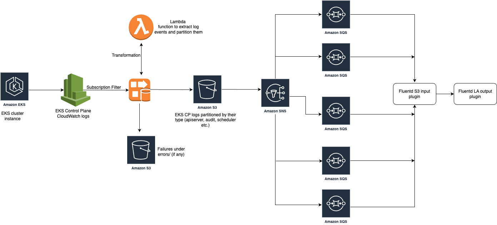

## Streaming of Control Plane logs from CloudWatch to S3

For the cases where EKS Control Plane logs volume in CloudWatch is high and cannot be pulled by the CloudWatch Fluentd plugin without running into throttling issues, we can use a CloudWatch logs subscription to stream log data in near real-time to AWS S3. Once available in S3, the log data can be ingested into OCI LA using Fluentd S3 input plugin and OCI LA Fluentd output plugin.

We can use a subscription filter with Kinesis Data Streams, Lambda or Kinesis Data Firehose. Logs that are sent to a receiving service through a subscription filter are base64 encoded and compressed with the gzip format. [FilterWithFirehose](https://docs.aws.amazon.com/AmazonCloudWatch/latest/logs/SubscriptionFilters.html#FirehoseExample) page documents the steps needed to push the logs to S3 in near real-time. Once the logs are available in S3 bucket, they can be pulled using S3 input plugin. The plugin works off Simple Queue Service (SQS) message/notification that's sent whenever a new object is written to S3 bucket. Due to a bug in S3 input plugin (documented at [https://github.com/fluent/fluent-plugin-s3/issues/418](https://github.com/fluent/fluent-plugin-s3/issues/418)), we would need to configure a combination of Simple Notification Service (SNS) and SQS so as to ensure that we do not loose any log data.

The high level work flow would look like this



### Create a new Lambda function

Create a new Lambda function using "Process CloudWatch logs sent to Kinesis Firehose" blueprint, preferably with Node.js 14.x runtime. Once created, the Lambda function's code needs to be updated & deployed so as to add a partition key based on CloudWatch log stream name. Note the Function ARN as it would be needed during the creation of Firehose delivery stream.

```
function processRecords (records) {
  return records.map(r => {
    const data = loadJsonGzipBase64(r.data)
    const recId = r.recordId
    // CONTROL_MESSAGE are sent by CWL to check if the subscription is reachable.
    // They do not contain actual data.
    if (data.messageType === 'CONTROL_MESSAGE') {
      return {
        result: 'Dropped',
        recordId: recId
      }
    } else if (data.messageType === 'DATA_MESSAGE') {
      // Replace "/" with an "_"
      let logGroupName = data.logGroup.replace(/\//g, '_')
      let logStreamName = data.logStream.replace(/\//g, '_')
      let prefix
      if (logStreamName.startsWith("kube-apiserver-audit")) {
        prefix = logGroupName + "/" + "kube-apiserver-audit/" + logStreamName
      } else if (logStreamName.startsWith("kube-apiserver")) {
        prefix = logGroupName + "/" + "kube-apiserver/" + logStreamName
      } else if (logStreamName.startsWith("authenticator")) {
        prefix = logGroupName + "/" + "authenticator/" + logStreamName
      } else if (logStreamName.startsWith("kube-controller-manager")) {
        prefix = logGroupName + "/" + "kube-controller-manager/" + logStreamName
      } else if (logStreamName.startsWith("cloud-controller-manager")) {
        prefix = logGroupName + "/" + "cloud-controller-manager/" + logStreamName
      } else if (logStreamName.startsWith("kube-scheduler")) {
        prefix = logGroupName + "/" + "kube-scheduler/" + logStreamName
      } else {
        prefix = "default"
      }
      const partition_keys = {
            object_prefix: prefix
        };
      const joinedData = data.logEvents.map(e => transformLogEvent(e)).join('')
      const encodedData = Buffer.from(joinedData, 'utf-8').toString('base64')
      return {
        data: encodedData,
        result: 'Ok',
        recordId: recId,
        metadata: { partitionKeys: partition_keys }
      }
    } else {
      return {
        result: 'ProcessingFailed',
        recordId: recId
      }
    }
  })
}
```

### Create a subscription filter with Amazon Kinesis Data Firehose

[FilterWithFirehose](https://docs.aws.amazon.com/AmazonCloudWatch/latest/logs/SubscriptionFilters.html#FirehoseExample) page documents what needs to be done to configure near real-time collection of EKS control plane logs into S3. We essentially need to follow the instructions on this page with some modifications, documented below.

#### Create S3 bucket

Below command creates a S3 bucket with the name "my-bucket" in "my-region" region. You can select the S3 bucket name and region as per your choice.

<details>
  <summary>Click here to expand...</summary>

```
aws s3api create-bucket --bucket my-bucket --create-bucket-configuration LocationConstraint=my-region
```
</details>

Create IAM role "FirehosetoS3Role", specifying the trust policy file "TrustPolicyForFirehose.json" as shown below. This role grants Kinesis Data Firehose permission to put data into the S3 bucket created above.

<details>
  <summary>Click here to expand...</summary>

```
{
  "Version": "2008-10-17",
  "Statement": [
    {
      "Effect": "Allow",
      "Principal": {
        "Service": "firehose.amazonaws.com"
      },
      "Action": "sts:AssumeRole"
    }
  ]
}
```
</details>

<details>
  <summary>Click here to expand...</summary>

```
aws iam create-role --role-name FirehosetoS3Role --assume-role-policy-document file://./TrustPolicyForFirehose.json
```
</details>

Create a permissions policy in file "PermissionsForFirehose.json" to define what actions Kinesis Data Firehose can do and associate it with the role "FirehosetoS3Role". Permission actions include putting objects into S3 bucket "my-bucket" and invoking Lambda function "my-function".

<details>
  <summary>Click here to expand...</summary>

```
{
  "Statement": [
    {
      "Effect": "Allow",
      "Action": [
        "s3:AbortMultipartUpload",
        "s3:GetBucketLocation",
        "s3:GetObject",
        "s3:ListBucket",
        "s3:ListBucketMultipartUploads",
        "s3:PutObject",
        "lambda:InvokeFunction"
      ],
      "Resource": [
        "arn:aws:s3:::my-bucket",
        "arn:aws:s3:::my-bucket/*",
        "arn:aws:lambda:my-region:aws-account-id:function:my-function"
      ]
    }
  ]
}
```
</details>

<details>
  <summary>Click here to expand...</summary>

```
aws iam put-role-policy --role-name FirehosetoS3Role --policy-name Permissions-Policy-For-Firehose --policy-document file://./PermissionsForFirehose.json
```
</details>

#### Create Firehose delivery stream

Create a destination Kinesis Data Firehose delivery stream "my-stream". This stream uses the Lambda function "my-function" created earlier to extract the log events and partition them before storage into S3.

<details>
  <summary>Click here to expand...</summary>

```
aws firehose create-delivery-stream --delivery-stream-name 'my-stream' --extended-s3-destination-configuration '{"RoleARN": "arn:aws:iam::aws-account-id:role/FirehosetoS3Role", "BucketARN": "arn:aws:s3:::my-bucket", "Prefix": "!{partitionKeyFromLambda:object\_prefix}/", "ErrorOutputPrefix": "errors/", "CompressionFormat": "GZIP", "DynamicPartitioningConfiguration": {"Enabled": true}, "ProcessingConfiguration": {"Enabled": true, "Processors": \[{"Type": "AppendDelimiterToRecord"},{"Type": "Lambda", "Parameters": \[{"ParameterName" :"LambdaArn", "ParameterValue" : "arn:aws:lambda:my-region:aws-account-id:function:my-function"}\]}\]}}'
```
</details>

Create an IAM role "CWLtoKinesisFirehoseRole" that grants CloudWatch logs permission to put data into Kinesis Data Firehose delivery stream created above.

<details>
  <summary>Click here to expand...</summary>

```
{
  "Version": "2008-10-17",
  "Statement": [
    {
      "Effect": "Allow",
      "Principal": {
        "Service": "logs.amazonaws.com"
      },
      "Action": "sts:AssumeRole",
      "Condition": {
        "StringLike": {
          "aws:SourceArn": "arn:aws:logs:my-region:aws-account-id:*"
        }
      }
    }
  ]
}
```
</details>

<details>
  <summary>Click here to expand...</summary>

```  
aws iam create-role --role-name CWLtoKinesisFirehoseRole --assume-role-policy-document file://./TrustPolicyForCWL.json
```
</details>

Create a permissions policy to define what actions CloudWatch logs can do.

<details>
  <summary>Click here to expand...</summary>

```
{
  "Statement": [
    {
      "Effect": "Allow",
      "Action": [
        "firehose:PutRecord"
      ],
      "Resource": [
        "arn:aws:firehose:my-region:aws-account-id:deliverystream/my-stream"
      ]
    }
  ]
}
```
</details>

<details>
  <summary>Click here to expand...</summary>

```  
aws iam put-role-policy --role-name CWLtoKinesisFirehoseRole --policy-name Permissions-Policy-For-CWL --policy-document file://./PermissionsForCWL.json
```
</details>

#### Create logs subscription filter

Create CloudWatch Logs subscription filter, choosing the appropriate CloudWatch log group name.

<details>
  <summary>Click here to expand...</summary>

```
aws logs put-subscription-filter --log-group-name "/aws/eks/<clusterName>/cluster" --filter-name "CWLToS3" --filter-pattern " " --destination-arn "arn:aws:firehose:my-region:aws-account-id:deliverystream/my-stream" --role-arn "arn:aws:iam::aws-account-id:role/CWLtoKinesisFirehoseRole"
```
</details>

Once the above steps are completed, the CloudWatch Logs will start appearing in S3 bucket. The log events would be partitioned before they are written to the S3 bucket. 
The S3 bucket object name would be created under \_aws\_eks\_\<clusterName\>\_cluster/logStreamType/\<logStreamName\>/ as shown below.


Once the EKS control plane logs in CloudWatch start streaming and are available in S3 bucket, we need to create and configure few other resources to enable us to collect the logs from S3 using S3 Fluentd plugin. 

**Create SQS Queues**

Create six SQS queues (like apiserver, audit, authenticator, kube-controller-manager, cloud-controller-manager, scheduler) of "Standard" type and note down their ARN.

**Create SNS topic**

Create SNS topic like "my-sns". Once created, edit it to add six new subscriptions, one for each of the SQS queues created above. For every subscription ensure that "Enable raw message delivery" is explicitly enabled.

**SQS access policy (needed for each of the SQS queues).**

The below access policy is for apiserver SQS queue. Update the name of the queue as appropriate.

<details>
  <summary>Click here to expand...</summary>

```
{
  "Statement": [
    {
      "Effect": "Allow",
      "Principal": {
        "Service": "sns.amazonaws.com"
      },
      "Action": "sqs:SendMessage",
      "Resource": "arn:aws:sqs:my-region:aws-account-id:apiserver",
      "Condition": {
        "ArnEquals": {
          "aws:SourceArn": "arn:aws:sns:my-region:aws-account-id:my-sns"
        }
      }
    }
  ]
}
```
</details>

**SNS access policy**

Also update its access policy (illustrated below) to allow S3 bucket "my-bucket" to publish to it.

<details>
  <summary>Click here to expand...</summary>

```
{
  "Version": "2012-10-17",
  "Id": "example-ID",
  "Statement": [
    {
      "Sid": "Example SNS topic policy",
      "Effect": "Allow",
      "Principal": {
        "Service": "s3.amazonaws.com"
      },
      "Action": "SNS:Publish",
      "Resource": "arn:aws:sns:my-region:aws-account-id:my-sns",
      "Condition": {
        "StringEquals": {
          "aws:SourceAccount": "aws-account-id"
        },
        "ArnLike": {
          "aws:SourceArn": "arn:aws:s3:*:*:my-bucket"
        }
      }
    }
  ]
}
```
</details>

**Update S3 bucket to send notifications** 

Go to the bucket properties and select "Create event notification" under "Event notifications". Select "All object create events" under "Event types". In Destination, select "SNS topic" and select the SNS topic created earlier, to which the event needs to be published.
